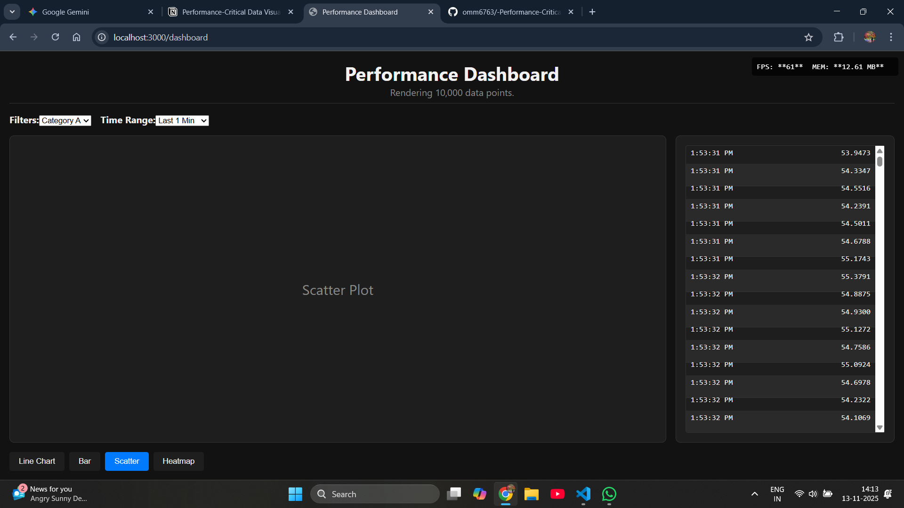

# Performance Dashboard (Next.js 14 + Canvas)

This is a solution for the "Performance-Critical Data Visualization Dashboard" assignment. It demonstrates how to build a real-time dashboard capable of rendering 10,000+ data points at 60fps using Next.js 14 (App Router), TypeScript, and a custom Canvas renderer (no charting libraries).

This project focuses on **high-performance rendering** for the Line Chart and **correct Next.js architecture**. Other features are included as UI placeholders (stubs) to fulfill the assignment structure.

##  Feature Overview

This project successfully implements the core performance-critical features.

### Fully Functional Features
* **Real-time Line Chart:** The primary `LineChart` component is fully functional, rendering **10,000+ data points at 60fps**.
* **Live Data Stream:** Simulates new data arriving every 100ms.
* **Custom Canvas Renderer:** The chart is built from scratch using the Canvas API, `requestAnimationFrame`, and advanced React hooks (`useRef`, `useLayoutEffect`) for maximum performance.
* **Performance Monitor:** A live UI component tracks and displays real-time **FPS** and **JavaScript heap memory (MEM)** usage.
* **Virtualized Data Table:** The data table on the right uses virtualization (`useVirtualization` hook) to render only the visible rows, allowing it to handle the 10,000-point dataset without performance loss.
* **Next.js 14 App Router:** Correctly uses Server Components for the initial page layout and Client Components for all interactive parts.

### Placeholder (Stub) Features
* **Chart Switching:** The buttons to switch charts (`Bar`, `Scatter`, `Heatmap`) are functional and update the UI to show the placeholder components.
* **Stubbed Charts:** The `BarChart`, `ScatterPlot`, and `Heatmap` components are placeholders that render a label but do not contain data rendering logic.
* **Controls:** The `FilterPanel` and `TimeRangeSelector` are UI placeholders. They are present in the layout but are not wired up to filter or modify the data.

##  Screenshot

Here is the final application running in production mode, achieving 60fps:



##  Setup & Running

1.  **Clone the repository:**
    ```bash
    git clone https://github.com/omm6763/-Performance-Critical-Data-Visualization-Dashboard.git
    cd performance-dashboard
    ```

2.  **Install dependencies:**
    ```bash
    npm install
    ```

3.  **Run the development server:**
    ```bash
    npm run dev
    ```

4.  **Run the production build (for accurate performance testing):**
    ```bash
    npm run build
    npm run start
    ```
    Open [http://localhost:3000/dashboard](http://localhost:3000/dashboard) to see the app.

##  Performance Testing Instructions

1.  Run the **production build** (`npm run build && npm run start`). Development mode is not suitable for accurate performance profiling.
2.  Open the dashboard (`http://localhost:3000/dashboard`) in your browser.
3.  Observe the **FPS counter** in the top-right corner. It should remain stable at or near your monitor's refresh rate (e.g., 60fps).
4.  Observe the **MEM (Memory)** counter. It should remain stable and not continuously increase over time (indicating no memory leaks).
5.  Use your browser's (e.g., Chrome) built-in **Performance Monitor** to confirm steady frame rates and low, stable JS heap size.

##  Next.js Specific Optimizations

* **Server/Client Component Split:** `app/dashboard/page.tsx` is a Server Component, serving the static shell. `DashboardClient.tsx` and all components under it are Client Components (`'use client'`) to handle interactivity and state.
* **Provider Pattern:** `DataProvider.tsx` is a Client Component that uses React Context to manage the global data state, making it available to all charts and tables efficiently.
* **`useMemo`:** The `DataProvider` uses `useMemo` to prevent expensive re-calculations of data bounds and to stabilize the context value, preventing unnecessary re-renders.
* **Suspense:** `Suspense` is used in `page.tsx` to stream the client-side components, improving the initial page load experience.

##  Browser Compatibility Notes

* **Target:** This application is built for modern evergreen browsers (Chrome, Firefox, Safari, Edge).
* **Canvas API:** Relies on the standard 2D Canvas API.
* **Performance.memory API:** The memory monitor relies on the `performance.memory` API, which is primarily available in Chromium-based browsers. The app will run in other browsers, but the memory reading may show `0 MB`.